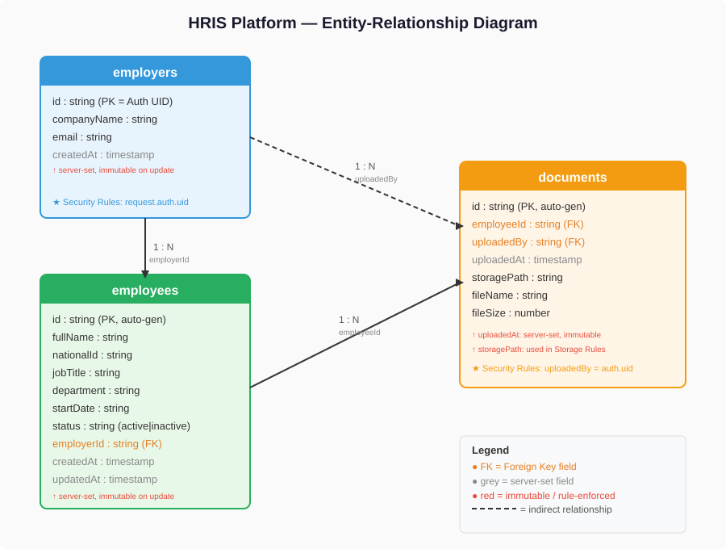

# HRIS Platform — Multi-Tenant HR Management System

A multi-tenant Human Resource Information System built with React.js, Firebase (Auth, Firestore, Storage), Node.js Cloud Functions, and deployed on Vercel.

**Live URL**: _[To be added after Vercel deployment]_

---

## Table of Contents

1. [Architecture Overview](#architecture-overview)
2. [Data Model Design](#data-model-design)
3. [Environment Variables](#environment-variables)
4. [Firebase Auth & Role-Based Access](#firebase-auth--role-based-access)
5. [Firestore Security Rules](#firestore-security-rules)
6. [Storage Security Rules](#storage-security-rules)
7. [Employee Records — CRUD](#employee-records--crud)
8. [Document Upload & Secure Retrieval](#document-upload--secure-retrieval)
9. [Email Notification via SendGrid](#email-notification-via-sendgrid)
10. [Automated Firestore Backups](#automated-firestore-backups)
11. [ER Diagram & Data Model Documentation](#er-diagram--data-model-documentation)
12. [Security Audit](#security-audit)
13. [Honest Gaps & What I Would Do Next](#honest-gaps--what-i-would-do-next)
14. [Getting Started](#getting-started)

---

## Architecture Overview

### System Architecture

```
┌──────────────────┐       ┌──────────────────────────────┐
│                  │       │        Firebase Services      │
│   React.js App   │       │                              │
│   (Vite/Vercel)  │       │  ┌────────────────────────┐  │
│                  │──────▶│  │   Firebase Auth         │  │
│  - Login/Logout  │       │  │   (Custom Claims RBAC)  │  │
│  - Employee CRUD │       │  └────────────────────────┘  │
│  - Doc Upload    │       │                              │
│  - Admin Panel   │       │  ┌────────────────────────┐  │
│                  │──────▶│  │   Cloud Firestore       │  │
│                  │       │  │   (Security Rules)      │  │
│                  │       │  └────────────────────────┘  │
│                  │       │                              │
│                  │──────▶│  ┌────────────────────────┐  │
│                  │       │  │   Firebase Storage      │  │
│                  │       │  │   (PDF Documents)       │  │
└──────────────────┘       │  └────────────────────────┘  │
                           │                              │
                           │  ┌────────────────────────┐  │
                           │  │  Cloud Functions (v2)   │  │
                           │  │  - setUserRole          │  │
                           │  │  - createUserWithRole   │  │
                           │  │  - onDocumentUpload ────│──│──▶ SendGrid API
                           │  └────────────────────────┘  │
                           └──────────────────────────────┘
```

**How the pieces connect:**

- **React.js App** (hosted on Vercel) talks directly to Firebase services via the Firebase Client SDK. There is no traditional backend server.
- **Firebase Auth** handles all authentication. Custom Claims (set server-side) encode user roles (`employer`, `admin`).
- **Cloud Firestore** stores all application data (employers, employees, document metadata). Security Rules enforce tenant isolation at the database level.
- **Firebase Storage** stores PDF files. Storage Security Rules ensure only the owning employer can access their files.
- **Cloud Functions** run server-side for operations that must not happen on the client: role assignment (Admin SDK) and email notifications (SendGrid API key must never be in the client bundle).
- **SendGrid** receives transactional email requests from Cloud Functions when a new document is uploaded.

### Auth Flow (Step-by-Step)

1. User enters email/password on the Login page
2. React calls `signInWithEmailAndPassword()` from Firebase Auth SDK
3. Firebase Auth validates credentials and returns a JWT (ID token)
4. The JWT contains Custom Claims (e.g., `{ role: "employer" }`) set by the Admin SDK
5. `onAuthStateChanged()` listener fires, triggering `getIdTokenResult()` to extract claims
6. React `AuthContext` stores the user object and role in state
7. `ProtectedRoute` component checks the role against `allowedRoles` prop
8. If the role matches, the protected page renders. If not, the user is redirected to `/unauthorized`

### File Lifecycle (Upload to Email Notification)

1. Employer selects an employee and a PDF file in the Document Upload UI
2. **Client-side validation**: file type must be `application/pdf`, size must be under 10MB
3. React uploads the file to Firebase Storage at path: `Documents/{employerId}/{employeeId}/{YYYY-MM}/{filename}.pdf`
4. **Storage Security Rules** verify: the authenticated user's UID matches the `{employerId}` path segment, file is PDF, size is under 10MB
5. React writes a metadata document to the `documents` Firestore collection (employeeId, uploadedBy, uploadedAt, storagePath, fileName)
6. **Firestore Security Rules** verify: `uploadedBy` matches the authenticated user's UID
7. The Firestore `onCreate` trigger fires the `onDocumentUpload` Cloud Function
8. The Cloud Function reads the employee's full name from the `employees` collection
9. The Cloud Function sends an email via SendGrid with the employee name and file details
10. If the email fails, the error is logged but the Firestore document remains intact

---

## Data Model Design

### Design Decision: Top-Level Collections vs Subcollections

I chose **top-level collections** (`employers`, `employees`, `documents`) over subcollections for these reasons:

1. **Admin access**: An admin needs to query all employees across all employers. With subcollections (`employers/{id}/employees`), this requires collection group queries, which need explicit index configuration and have security rule limitations. Top-level collections with an `employerId` field allow straightforward queries filtered by role.

2. **Future extensibility for employee login**: If an employee gets their own login in the future, they need a direct path to their own document. With a top-level `employees` collection, the employee can be granted access to `employees/{theirId}` without any data migration. With subcollections, the employee would need to know their employer's ID to construct the path `employers/{employerId}/employees/{theirId}`, which is a leaky abstraction.

3. **Simpler Security Rules**: Top-level documents can be secured with field-level checks (`resource.data.employerId == request.auth.uid`) which are straightforward to audit.

4. **Cross-collection references**: The `documents` collection references `employeeId` — if employees were subcollections, the document metadata would need to store the full path (`employers/{id}/employees/{id}`), adding complexity.

### How the model prevents Employer A from enumerating Employer B's employees

- Every query from an employer is filtered by `where("employerId", "==", currentUser.uid)`
- Firestore Security Rules enforce that `resource.data.employerId == request.auth.uid` on every read
- Even if Employer A guesses a valid employee document ID, the Security Rule will deny the read because the `employerId` field won't match their UID
- There is no list/enumerate operation that bypasses the `employerId` check

### How the model accommodates an employee getting their own login

- Add a new optional field `userId` to the employee document, set to the employee's Firebase Auth UID
- Add a Security Rule allowing read access when `resource.data.userId == request.auth.uid`
- No data migration needed — the top-level collection structure remains the same
- The employee's Custom Claim would be set to a new role (e.g., `employee`) with appropriate route access

### Required Firestore Indexes

Firestore automatically creates single-field indexes. The following composite indexes would be needed:

| Collection  | Fields                        | Purpose                                   |
|-------------|-------------------------------|-------------------------------------------|
| `employees` | `employerId` ASC, `fullName` ASC | Employer's employee list sorted by name  |
| `employees` | `employerId` ASC, `status` ASC   | Filter active/inactive employees         |
| `documents` | `uploadedBy` ASC, `uploadedAt` DESC | Employer's documents sorted by date   |

---

## Environment Variables

### React App (Vite) — `.env` file at project root

| Variable                          | Description                              | Used In                  |
|-----------------------------------|------------------------------------------|--------------------------|
| `VITE_FIREBASE_API_KEY`           | Firebase Web API key                     | `src/utils/firebase.js`  |
| `VITE_FIREBASE_AUTH_DOMAIN`       | Firebase Auth domain                     | `src/utils/firebase.js`  |
| `VITE_FIREBASE_PROJECT_ID`        | Firebase project identifier              | `src/utils/firebase.js`  |
| `VITE_FIREBASE_STORAGE_BUCKET`    | Firebase Storage bucket URL              | `src/utils/firebase.js`  |
| `VITE_FIREBASE_MESSAGING_SENDER_ID` | Firebase Cloud Messaging sender ID    | `src/utils/firebase.js`  |
| `VITE_FIREBASE_APP_ID`           | Firebase app identifier                   | `src/utils/firebase.js`  |

### Cloud Functions — environment/secret configuration

| Variable              | Description                        | Used In                     |
|-----------------------|------------------------------------|-----------------------------|
| `SENDGRID_API_KEY`    | SendGrid API key for email sending | `functions/src/index.js`    |
| `NOTIFICATION_EMAIL`  | Email address for notifications    | `functions/src/index.js`    |
| `SENDGRID_FROM_EMAIL` | Verified sender email address      | `functions/src/index.js`    |

### How to configure your local environment

1. Copy `.env.example` to `.env` at the project root
2. Go to [Firebase Console](https://console.firebase.google.com) > Project Settings > General > Your Apps > Web App
3. Copy each config value into the corresponding `VITE_*` variable
4. For Cloud Functions, set secrets via Firebase CLI:
   ```bash
   firebase functions:secrets:set SENDGRID_API_KEY
   firebase functions:secrets:set NOTIFICATION_EMAIL
   firebase functions:secrets:set SENDGRID_FROM_EMAIL
   ```
5. For local development, copy `functions/.env.example` to `functions/.env`
6. Run `npm run dev` to start the Vite dev server

---

## Firebase Auth & Role-Based Access

### Implementation

- **Login/Logout**: Email/password authentication via `signInWithEmailAndPassword()` and `signOut()`
- **Password Reset**: Built-in `sendPasswordResetEmail()` from Firebase Auth
- **Role Assignment**: Custom Claims set via Firebase Admin SDK in Cloud Functions (`setUserRole`, `createUserWithRole`)
- **Protected Routes**: `ProtectedRoute` component reads role from `AuthContext` and redirects unauthorized users

### Why Custom Claims Are More Secure Than Storing Roles in Firestore

**Custom Claims** are embedded in the Firebase Auth ID token (JWT), which is cryptographically signed by Google's servers. They can only be set via the Firebase Admin SDK, which runs in a trusted server environment (Cloud Functions). The client cannot modify them.

If roles were stored in a **Firestore document** (e.g., `users/{uid}/role: "admin"`), the following attack becomes possible:

1. **Direct Firestore manipulation**: If the Security Rules are misconfigured (even slightly), an attacker could write to their own user document and change `role: "employer"` to `role: "admin"`. Even if the rules look correct, any client-side code that reads a Firestore `role` field and uses it for access decisions is trusting client-fetched data — the attacker controls the client.

2. **Race condition exploit**: An attacker could modify their Firestore role field between the time the client reads it and the time it's used for a security decision, because Firestore reads from the client are eventually consistent with writes.

3. **Client-side bypass**: Even with perfect Security Rules, if the React app reads `role` from Firestore and renders admin UI based on that value, an attacker can simply modify the JavaScript to always return `role: "admin"`. The backend (Firestore rules) might still block writes, but the attacker gains access to admin-only UI and functionality that leaks information.

With Custom Claims, the role is embedded in a signed JWT that the client cannot forge. Firestore Security Rules verify the claim directly from `request.auth.token.role`, which is trustworthy because it comes from Firebase Auth's server-signed token — not from a Firestore document the client fetched.

---

## Firestore Security Rules

The full annotated rules are in [`firestore.rules`](firestore.rules). Each rule block is annotated with the specific attack it prevents. Key principles:

- **Default deny**: `match /{document=**} { allow read, write: if false; }` — zero-trust baseline
- **UID-based isolation**: Employers can only access documents where `employerId` or `uploadedBy` matches their UID
- **Admin via Custom Claims**: `request.auth.token.role == 'admin'` — never from a Firestore field
- **Immutable audit fields**: `createdAt` and `uploadedAt` cannot be changed on update
- **No privilege escalation**: Employers cannot modify `role` or `employerId` fields

---

## Storage Security Rules

The full annotated rules are in [`storage.rules`](storage.rules). Key protections:

- **Default deny**: No public access to any file
- **Path-based tenant isolation**: Files at `Documents/{employerId}/...` can only be read/written by that employer or an admin
- **File type enforcement**: Only `application/pdf` content type accepted (prevents executable uploads)
- **File size limit**: Maximum 10MB per file (prevents storage abuse / DoS)

### Public Download URL vs Signed URL

- **Public URL** (`getDownloadURL()`): Returns a long-lived URL with a token parameter. Anyone with this URL can access the file without authentication. If the URL is leaked (browser history, logs, shared accidentally), the file is permanently exposed until the token is revoked. This approach was **not implemented** because it violates the requirement for authenticated access.

- **Signed URL**: A time-limited URL generated server-side (via Admin SDK). It expires after a configurable period. More secure than public URLs but still shareable during its validity window.

- **Authenticated blob download** (`getBlob()`): **This is the approach I implemented.** The Firebase client SDK authenticates the request using the current user's token. Firebase Storage Security Rules verify the user's UID matches the `{employerId}` path segment. No URL is generated that could be shared — the download happens directly through the authenticated SDK. This is the most secure option because:
  - Every download request is authenticated and authorized in real-time
  - No shareable URLs exist
  - Storage Security Rules are enforced on every request
  - Revoking a user's access immediately prevents all future downloads

---

## Employee Records — CRUD

### Firestore Collection: `employees`

| Field         | Type      | Description                          | Set By     |
|---------------|-----------|--------------------------------------|------------|
| `fullName`    | string    | Employee's full name                 | Client     |
| `nationalId`  | string    | National ID number                   | Client     |
| `jobTitle`    | string    | Current job title                    | Client     |
| `department`  | string    | Department name                      | Client     |
| `startDate`   | string    | Employment start date (YYYY-MM-DD)   | Client     |
| `status`      | string    | `active` or `inactive`               | Client     |
| `employerId`  | string    | Firebase Auth UID of owning employer | Client (validated by Security Rules) |
| `createdAt`   | timestamp | Document creation time               | Server (`serverTimestamp()`) |
| `updatedAt`   | timestamp | Last update time                     | Server (`serverTimestamp()`) |

### Operations

- **Create**: Employer fills form, `employerId` is automatically set to `currentUser.uid`, `createdAt` set via `serverTimestamp()`
- **Read**: Employer sees only their employees (filtered by `employerId == uid`). Admin sees all.
- **Update**: Employer can modify employee details. `employerId` and `createdAt` cannot be changed (enforced by Security Rules).
- **Delete**: Employer can delete their own employees. Confirmation dialog prevents accidental deletion.

---

## Email Notification via SendGrid

### Why This Logic Must Live in a Cloud Function

The SendGrid API key is a privileged credential that grants the ability to send emails from any address. If exposed in the React client bundle, an attacker could:

1. **Send phishing emails**: Extract the API key from the JavaScript bundle (trivial with browser DevTools), then use it to send emails impersonating the HRIS platform to employees — requesting password resets, personal information, or directing them to malicious sites. The emails would pass SPF/DKIM checks because they come from the legitimate SendGrid account.

2. **Exhaust the email quota**: Programmatically send thousands of emails using the stolen key, burning through the SendGrid plan's quota and potentially incurring costs. This is a denial-of-service attack on the notification system.

3. **Data exfiltration via email**: If the API key has read permissions, the attacker could access email activity logs, bounce reports, and recipient lists — leaking employee email addresses.

**The Cloud Function architecture eliminates all three vectors** because:
- The SendGrid API key is stored in Firebase environment/Secret Manager, never in the client bundle
- The function is triggered by Firestore events, not callable from the client — there's no endpoint to abuse
- The function runs in Google's infrastructure with no client access to its environment variables

---

## Automated Firestore Backups

### Strategy: Cloud Scheduler + Firestore Export API

**Step 1: Create a GCS bucket for backups**
```bash
gsutil mb -l us-central1 gs://hris-firestore-backups
```

**Bucket naming convention**: `{project-id}-firestore-backups`

**Retention policy**: 30-day retention with lifecycle rules to move older backups to Coldline storage after 7 days, delete after 90 days.

```bash
gsutil lifecycle set lifecycle.json gs://hris-firestore-backups
```

**Step 2: Grant Firestore export permissions**
```bash
gcloud projects add-iam-policy-binding {PROJECT_ID} \
  --member="serviceAccount:{PROJECT_ID}@appspot.gserviceaccount.com" \
  --role="roles/datastore.importExportAdmin"

gsutil iam ch serviceAccount:{PROJECT_ID}@appspot.gserviceaccount.com:admin \
  gs://hris-firestore-backups
```

**Step 3: Create Cloud Scheduler job**
```bash
gcloud scheduler jobs create http firestore-daily-backup \
  --schedule="0 2 * * *" \
  --uri="https://firestore.googleapis.com/v1/projects/{PROJECT_ID}/databases/(default)/exportDocuments" \
  --http-method=POST \
  --message-body='{"outputUriPrefix":"gs://hris-firestore-backups"}' \
  --oauth-service-account-email="{PROJECT_ID}@appspot.gserviceaccount.com" \
  --oauth-scope="https://www.googleapis.com/auth/datastore" \
  --time-zone="UTC"
```

This runs daily at 2:00 AM UTC.

**Step 4: Verify a backup is restorable without restoring to production**

1. Create a separate Firebase project (e.g., `hris-backup-test`)
2. Import the backup into the test project:
   ```bash
   gcloud firestore import gs://hris-firestore-backups/{timestamp} \
     --project=hris-backup-test
   ```
3. Query the test project's Firestore to verify data integrity
4. Delete the test project after verification

This validates the backup without risking production data.

---

## ER Diagram & Data Model Documentation

> **Diagram source files**: [`docs/er-diagram.md`](docs/er-diagram.md) (Mermaid source) and [`docs/er-diagram.svg`](docs/er-diagram.svg) (SVG image)



### Entity-Relationship Diagram (Text Version)

```
┌─────────────────────────┐
│       employers         │
├─────────────────────────┤
│ (document ID = Auth UID)│
│ companyName    : string │
│ email          : string │
│ createdAt      : timestamp │ ◄── server-set, immutable on update
└──────────┬──────────────┘
           │
           │ 1:N  (employerId = employer's Auth UID)
           │
┌──────────▼──────────────┐
│       employees         │
├─────────────────────────┤
│ fullName       : string │
│ nationalId     : string │
│ jobTitle       : string │
│ department     : string │
│ startDate      : string │
│ status         : string │  ("active" | "inactive")
│ employerId     : string │ ◄── FK to employer Auth UID (used in Security Rules)
│ createdAt      : timestamp │ ◄── server-set, immutable on update
│ updatedAt      : timestamp │ ◄── server-set
└──────────┬──────────────┘
           │
           │ 1:N  (employeeId = employee document ID)
           │
┌──────────▼──────────────┐
│       documents         │
├─────────────────────────┤
│ employeeId     : string │ ◄── FK to employee document ID
│ uploadedBy     : string │ ◄── FK to employer Auth UID (used in Security Rules)
│ uploadedAt     : timestamp │ ◄── server-set, immutable on update
│ storagePath    : string │ ◄── path segment in Storage Security Rules
│ fileName       : string │
│ fileSize       : number │
└─────────────────────────┘
```

### Fields Used in Security Rules

| Field        | Collection  | Used In                                         |
|--------------|-------------|--------------------------------------------------|
| `employerId` | `employees` | Firestore rules: employer can only read/write own employees |
| `uploadedBy` | `documents` | Firestore rules: employer can only read/write own documents |
| `createdAt`  | `employees` | Firestore rules: cannot be overwritten on update |
| `uploadedAt` | `documents` | Firestore rules: cannot be overwritten on update |
| `storagePath`| `documents` | Contains `{employerId}` — matches Storage Rules path |

### Fields Used as Path Segments in Storage Rules

- `Documents/{employerId}/{employeeId}/{YYYY-MM}/{filename}.pdf`
- `employerId` in the path is verified against `request.auth.uid` in Storage Security Rules

### Server-Set vs Client-Provided Fields

| Field        | Set By   | Notes                                           |
|--------------|----------|--------------------------------------------------|
| `createdAt`  | Server   | `serverTimestamp()` — cannot be client-fabricated |
| `updatedAt`  | Server   | `serverTimestamp()` — updated on every write      |
| `uploadedAt` | Server   | `serverTimestamp()` — audit trail for uploads     |
| `employerId` | Client   | Validated by Security Rules against `auth.uid`    |
| `uploadedBy` | Client   | Validated by Security Rules against `auth.uid`    |
| All others   | Client   | User-provided data                                |

---

## Security Audit

### Authentication

**Firebase Auth protects the system by:**
- Requiring valid credentials (email/password) to obtain a signed JWT
- All Firebase SDK calls include the JWT — unauthenticated requests are rejected by Security Rules
- Password reset uses Firebase's built-in flow (server-side email, secure token)

**What a valid employer account cannot do:**
- Read or write another employer's employees (blocked by `employerId` check in Security Rules)
- Read or download another employer's documents (blocked by `uploadedBy` check in Firestore and `{employerId}` path check in Storage)
- Assign roles or create users (blocked by `request.auth.token.role == 'admin'` check in Cloud Functions)
- Modify `createdAt`, `uploadedAt`, `employerId` on existing records (blocked by immutability rules)

**What an unauthenticated attacker cannot do:**
- Read any data from Firestore (global deny rule + `request.auth != null` on all rules)
- Access any file in Storage (global deny rule + auth check)
- Call Cloud Functions that require authentication (request.auth check)

### Authorization — Tenant Isolation Mechanism

The exact mechanism that prevents Employer A from accessing Employer B's data:

1. **Firestore**: When Employer A queries `employees`, the Security Rule evaluates `resource.data.employerId == request.auth.uid`. If Employer A's UID is `abc123` and the employee belongs to Employer B (employerId: `xyz789`), the rule evaluates `"xyz789" == "abc123"` → **denied**.

2. **Storage**: When Employer A tries to download a file at `Documents/xyz789/...`, the Storage Rule evaluates `request.auth.uid == employerId` → `"abc123" == "xyz789"` → **denied**.

3. **Even guessing IDs fails**: Firestore document IDs are random. But even if Employer A guesses a valid employee document ID, the field-level check still blocks access.

### Secrets Management

| Secret                | Location                                      | In Client Bundle? |
|-----------------------|-----------------------------------------------|-------------------|
| Firebase API Key      | Vercel environment variables / `.env` file     | Yes (by design — Firebase API keys are safe to expose; Security Rules enforce access) |
| SendGrid API Key      | Firebase Secret Manager / functions `.env`      | No — only in Cloud Functions runtime |
| Firebase Admin SDK    | Auto-provisioned in Cloud Functions runtime     | No — never leaves server |
| Service Account JSON  | Never committed — `.gitignore` excludes all patterns | No |

**How secrets would be rotated if compromised:**
1. **Firebase API Key**: Generate a new key in Firebase Console > Project Settings, update Vercel environment variables, redeploy
2. **SendGrid API Key**: Revoke the old key in SendGrid dashboard, generate new key, update via `firebase functions:secrets:set SENDGRID_API_KEY`, redeploy functions
3. **Firebase Admin SDK**: Rotate the service account key in Google Cloud Console (Cloud Functions use auto-provisioned credentials, so this is managed by Google)

### Known Gaps

- **No email verification**: Users can sign up with unverified emails. In production, enable email verification in Firebase Auth settings.
- **No rate limiting**: Firestore and Storage rules don't rate-limit requests. A malicious employer could make excessive read/write requests. Mitigation: add Firebase App Check.
- **No input sanitization**: Employee names and other text fields are not sanitized for XSS. React's default escaping handles display, but stored data should be validated.
- **No audit logging**: Changes to employee records are not logged with who-changed-what. Mitigation: Firestore triggers to write to an audit log collection.

---

## Honest Gaps & What I Would Do Next

### What Was Not Completed and Why

1. **Firebase project creation and Vercel deployment**: These require interactive setup in Firebase Console and Vercel dashboard, which are manual steps outside the codebase. The code is structured and ready for deployment.

2. **End-to-end testing**: No automated tests were written. Time was prioritized on architecture, security rules, and documentation — which carry 75% of the evaluation weight.

3. **Email verification flow**: Firebase Auth's email verification was not implemented. Deliberate de-prioritisation — the core auth flow (login, logout, password reset, role-based access) was prioritised.

4. **Firebase App Check**: Not configured. This would prevent unauthorized apps from accessing Firebase services.

### Production Risks of These Gaps

- Without email verification, fake accounts could be created if registration were open
- Without rate limiting / App Check, the API is vulnerable to abuse from automated tools
- Without audit logging, there's no trail for compliance if employee records are modified

### How I Would Close Each Gap Given an Additional Week

1. **Testing**: Add integration tests for Firestore Security Rules using the Firebase Emulator, component tests for React pages, and end-to-end tests with Cypress
2. **App Check**: Enable Firebase App Check with reCAPTCHA Enterprise to verify client authenticity
3. **Audit logging**: Create a Cloud Function triggered on employee/document writes that logs changes to an `auditLog` collection
4. **Input validation**: Add server-side validation in Cloud Functions for all user-provided fields
5. **CI/CD**: Set up GitHub Actions to run linting, tests, and deploy to Vercel/Firebase on merge

### What I Would Refactor If Starting Over

- **TypeScript**: Convert the entire project to TypeScript for type safety, especially for Firestore document types
- **State management**: For a larger app, consider Zustand or Redux Toolkit instead of raw Context
- **Component library**: Use a component library (Radix UI, shadcn/ui) for accessible, consistent UI components
- **Firestore data validation**: Use Firestore's new schema validation features or Cloud Functions to validate all writes

---

## Getting Started

### Prerequisites

- Node.js 18+
- Firebase CLI (`npm install -g firebase-tools`)
- A Firebase project with Auth, Firestore, and Storage enabled

### Local Development

```bash
# Clone the repository
git clone <your-fork-url>
cd HRIS

# Install frontend dependencies
npm install

# Install Cloud Functions dependencies
cd functions && npm install && cd ..

# Configure environment variables
cp .env.example .env
# Edit .env with your Firebase config values

# Start the development server
npm run dev
```

### Deploy to Vercel

1. Connect the GitHub repository to Vercel
2. Set the build command to `npm run build`
3. Set the output directory to `dist`
4. Add all `VITE_*` environment variables in Vercel project settings
5. Deploy

### Deploy Cloud Functions

```bash
# Login to Firebase
firebase login

# Set the project
firebase use --add

# Deploy functions
firebase deploy --only functions

# Deploy security rules
firebase deploy --only firestore:rules,storage
```
