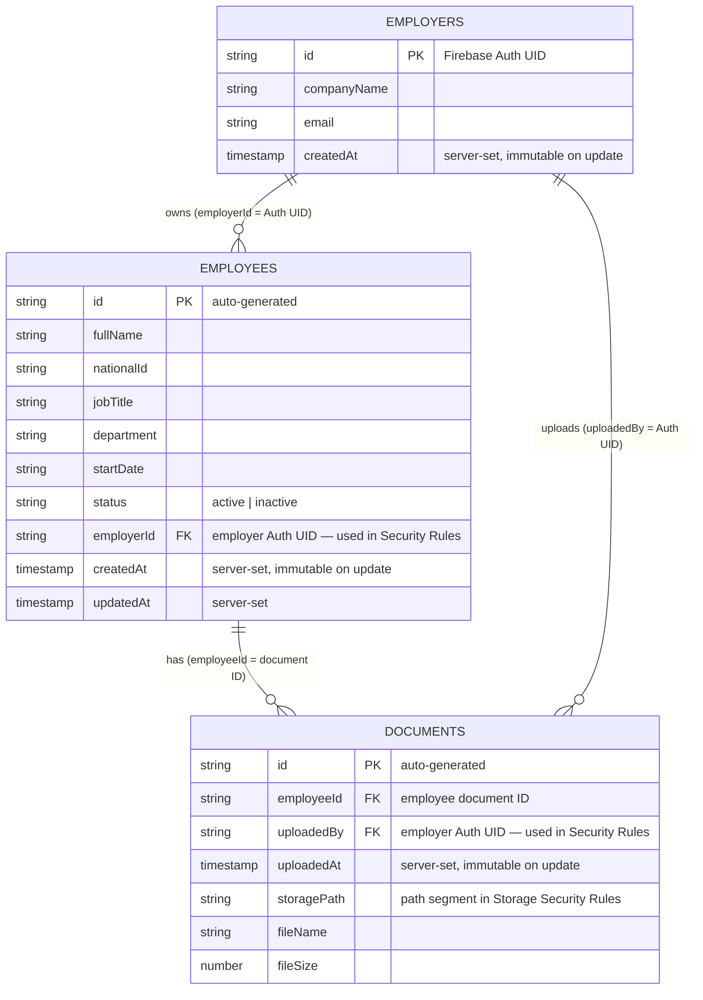

# HRIS Platform — Entity-Relationship Diagram (Mermaid Source)

## Field Usage in Security Rules

| Field        | Collection  | Security Rule Purpose                                    |
|--------------|-------------|----------------------------------------------------------|
| `employerId` | employees   | Employer can only read/write own employees               |
| `uploadedBy` | documents   | Employer can only read/write own documents               |
| `createdAt`  | employees   | Cannot be overwritten on update (audit integrity)        |
| `uploadedAt` | documents   | Cannot be overwritten on update (audit integrity)        |
| `storagePath`| documents   | Contains `{employerId}` matching Storage Rules path      |

## Server-Set vs Client-Provided Fields

| Field        | Set By   | Validation                                               |
|--------------|----------|----------------------------------------------------------|
| `createdAt`  | Server   | `serverTimestamp()` — Security Rules verify `is timestamp`|
| `updatedAt`  | Server   | `serverTimestamp()` — updated on every write              |
| `uploadedAt` | Server   | `serverTimestamp()` — Security Rules verify `is timestamp`|
| `employerId` | Client   | Security Rules verify matches `request.auth.uid`         |
| `uploadedBy` | Client   | Security Rules verify matches `request.auth.uid`         |
| All others   | Client   | User-provided data                                       |
